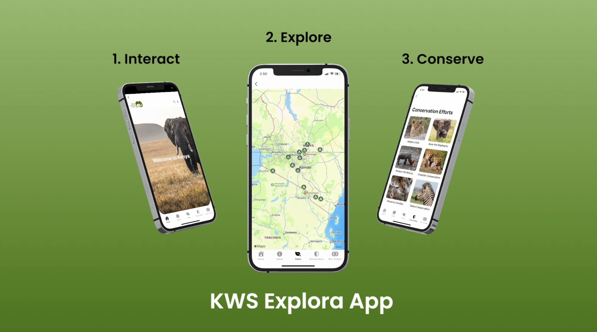
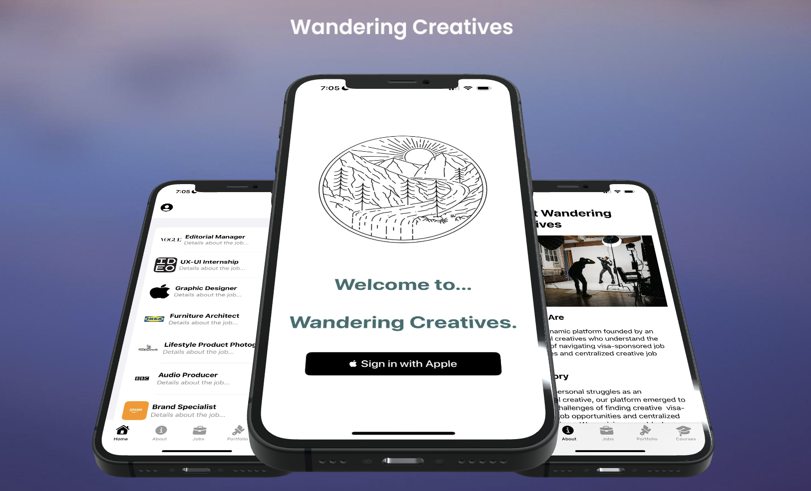

&nbsp;&nbsp;&nbsp;

## KWS Explora 🌳
[KWS Explora](https://github.com/RayPops/kws-app)  is your ultimate guide to navigating Kenya's national parks. Designed for adventurers and nature lovers, this app provides detailed information on each park, helping users plan their visits with ease. Whether you're interested in the diverse wildlife of the Maasai Mara, the breathtaking landscapes of Amboseli, or the serene waters of Lake Nakuru, the KWS Park Explorer App brings Kenya's natural heritage to your fingertips.

This mobile app not only showcases the parks but also enriches your visit with features like park maps, wildlife guides, and the latest news on park conditions. Built with the user in mind, the app aims to create a seamless experience for planning and enjoying your adventure in Kenya's outdoors.

🔨Technologies: SwiftUI for a modern and responsive user interface, Swift for robust app performance, and iOS SDK for integration with the latest iOS features. The app also utilizes Xcode as the development environment, ensuring a smooth build process. Developed as a passion project.
🚀Platform: 📱iOS

## Wandering Creatives 🎨
[Wandering Creatives](https://github.com/RayPops/wandering-creatives-app) is an innovative platform dedicated to empowering creative professionals across the UK. With a focus on simplifying the job hunt for those requiring visa sponsorship, our app centralizes creative job listings, making them accessible and manageable.

The app features an intuitive map interface, implemented with MapKit, which showcases job opportunities in various creative fields. From graphic design to audio production, Wandering Creatives is a hub for job seekers to find their next career step within the creative industry.

Additionally, the app allows for a seamless sign-in experience with Apple's secure authentication, ensuring user privacy and convenience. Each job listing is detailed and includes essential information about the role and the company, giving users the insight they need to make informed decisions.

🔨Technologies: Designed with Swift UI for an elegant and user-friendly interface, and the backend powered by Swift, the app offers robust performance and a seamless user experience. The development process was facilitated by Xcode, which provided a stable and efficient environment for app creation.
🚀Platform: 📱iOS

